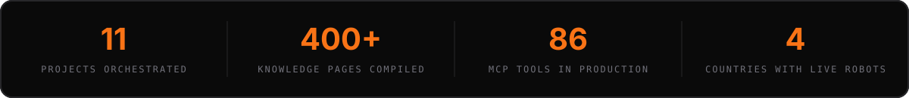

  

**AI & robotics engineer in Singapore building perception, agents, and learning systems that compound over time.**

Founding Engineer & Technical Lead at [Salesbugle](https://salesbugle.com), an AI sales coaching SaaS I built from an empty repository to production as the sole engineer. Formerly Robotics & Vision Engineer at Mozark, where I led robotic mobile-device testing systems (Delta robots, computer vision + OCR pipelines, agentic LLM test creation) deployed across Singapore, Philippines, Thailand, and India. MSc Robotics, National University of Singapore.

## What I work on

<table>
<tr>
<td width="50%" valign="top">

### 🦾 Robotics & perception
Delta robots, ROS, OpenCV, OCR, template matching, sensor fusion: systems that act on the physical world from what a camera sees.

</td>
<td width="50%" valign="top">

### 🗣️ Voice, vision & language together
Real-time meeting AI that joins live calls, listens (streaming Whisper ASR, VAD, diarization), presents, and answers by name.

</td>
</tr>
<tr>
<td width="50%" valign="top">

### 🤖 AI agents in production
Agentic chat with governed writes and audit trails; a hosted remote MCP server exposing 86 tools to any MCP client.

</td>
<td width="50%" valign="top">

### 🧠 Learning systems that compound
[amoOS](https://aungmyintoo.com/amoos): a fleet of coding agents building across 11 projects, every lesson compiled into a 400+ page knowledge base the agents load next time.

</td>
</tr>
</table>

## Stack

**AI & agents** &nbsp;

**Robotics & perception** &nbsp;

**Product & infra** &nbsp;

## Selected work

| Project | What it is |
|---|---|
| [Atlas](https://github.com/davidamo9/atlas) | MCP server that indexes codebases via Tree-sitter AST and serves semantic context to coding agents, with 85-90% token reduction. |
| [optics-framework](https://github.com/davidamo9/optics-framework-public) | Open-source no-code test automation on PyPI: Appium + computer vision + Delta robot arms + an agentic LLM layer. |
| [Robotic telemanipulation](https://aungmyintoo.com/telemanipulation) | NUS MSc thesis: natural language → computer vision → robot action, end to end. |
| [Real-time meeting intelligence](https://aungmyintoo.com/meeting-intelligence) | The live-meeting stack behind Salesbugle: an AI participant that presents, listens, and answers by name. |
| [amoOS](https://aungmyintoo.com/amoos) | My personal software factory: agents build, I plan, dispatch, and verify; the memory compounds. |

---

Open to **founding engineer** roles and early-stage **technical co-founder** partnerships, especially where robotics, perception, or learning systems meet a real product.

**The first conversation is free** → [aungmyintoo.com](https://aungmyintoo.com/#contact)

